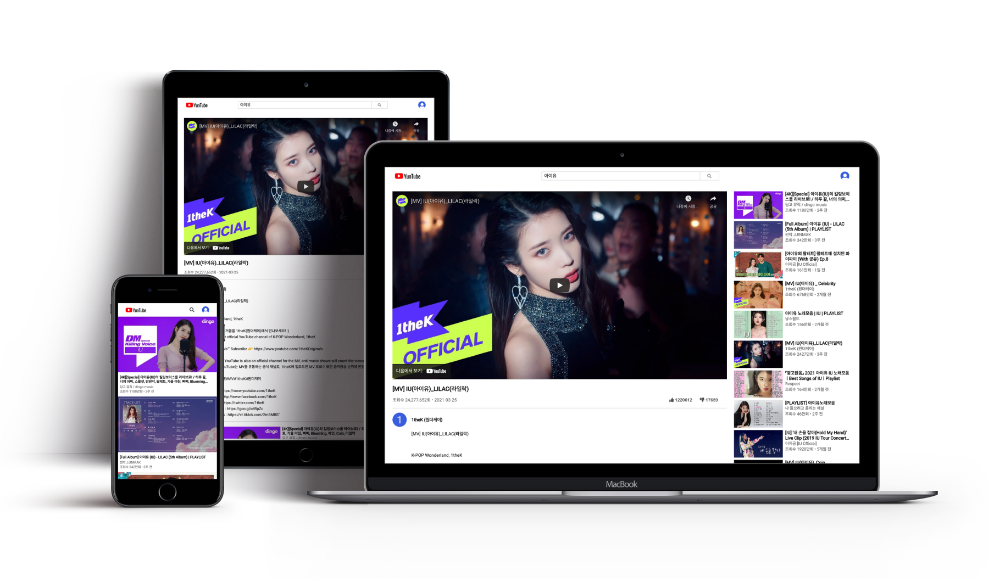

# Simple youtube clone

react 학습을 위한 클론 코딩 프로젝트입니다. 
오리지널 youtube의 주요 기능인 인기 동영상 피드, 동영상 검색 및 재생, 스크롤을 이용한 페이지로드가 가능합니다.

## Screenshots

반응형 웹으로 디자인 하였으며, YouTube Data API를 이용한 실제데이터로 구성됩니다. 
목록에서 각 영상의 썸네일, 제목, 채널 이름 외에 조회수, 업로드된 날짜가 표시됩니다.

## Features

- 인기 동영상 피드
- 동영상 검색
- 선택 동영상 재생
- 영상에 대한 정보 확인
- Infinite scroll
- Lazy lode

## What i learned

구현 과정에서 겪었던 문제와 해결 방법에 대해 서술합니다.

1. [Mobx](https://mobx.js.org/README.html)

   ❓ YouTube Data API로 받아온 pagetoken을 이용해 페이징구현을 하는데 데이터가 복잡해짐에따라 setState 비동기 문제로 인해 원하는 대로 구현되지않고 버그 발생

   ❕ 이 기회로 React를 공부하며 알게된 상태 관리 라이브러리를 적용을 시도했고 Redux에 비해 낮은 러닝 커브와 단순한 코드를 구현할수있다는 점에서 Mobx를 선택했다.  store를 분리함에 따라 component가 단순해졌고 setState의 비동기로 인한 렌더링 문제도 해결됐다. MobX의 Observable 데이터들은 React.Component의 state 객체 특성을 갖지 않기때문에 불변성 유지를 위한 추가적인 코드들을 작성할 필요가 없어 코드를 훨씬 간결하게 작성할 수 있다.

2. [IntersectionObserver API](https://developer.mozilla.org/en-US/docs/Web/API/Intersection_Observer_API)

   ❓ 처음에 Infinite scroll을 scroll event를 이용하여 구현했는데 반응이 늦어 뚝뚝 끊기는 등 사용성이 떨어지게느껴졌다. scroll event로 무한 스크롤을 구현하게 되면 매 스크롤마다 이벤트를 감지하게되어 핸들러함수가 계속해서 호출되고 이를 컨트롤하기 위해 추가로 debounce와 throttle을 사용해야한다. 이외에도 화면 가장 끝이아니라 중간 쯤에서 아이템들을 불러오도록 하고 싶었는데 구현하기가 까다로웠다.

   ❕ 기준이 되는 아이템과 [`viewport`](https://developer.mozilla.org/en-US/docs/Glossary/Viewport)가 교차되는 부분을 비동기적으로 관찰하는 intersectionObserver API로 변경, 성능이 크게 개선되었으며 기준이 되는 아이템의 마진값을 이용해서 화면 중간에서 이벤트를 발생 시킬 수 있었다.

3. [Styled component](https://styled-components.com/)

   ❓ pc에선 괜찮았지만 mobile에서 목록에 썸네일들과 스크롤링 후 nextpage를 받아오는 데에 상당한 시간이 걸렸다. 
   이를 개선하고자 위에서 적용한 IntersectionObserver API를 이용해서 각 아이템에 Lazylode를 구현했으나 로드되기 전 아이템의 크기가 0x0이기 때문에 순간 모든 아이템이 viewport안에 들어오면서 Lazyload가 제대로 작동되지 않았다.

   ❕ Skeleton UI를 적용 아이템에 너비,높이를 지정해서 문제를 해결했다. Skeleton 아이템은 작성 되어있던 컴포넌트를 재사용하기 위해 Styled Component를 사용해서 만들었다.

## Acknowledgements

- [Dream Coding](https://academy.dream-coding.com/)
- [나무소리](https://youtube.com/playlist?list=PLOSNUO27qFbtYC5oRwJVsNavcPEI5uoiJ)
- [Font Awesome](https://fontawesome.com/)
